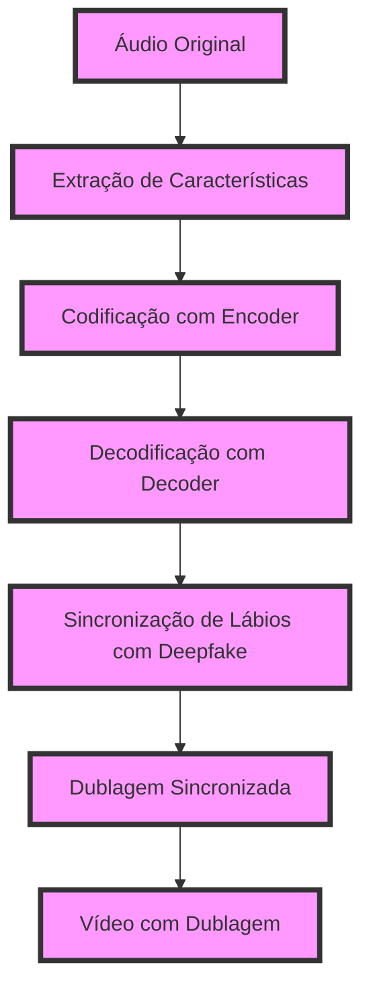

A DublAI é uma ferramenta de dublagem e traducao natural usando inteligencia artificial para recriar a voz original e sua entonacoes e nuances de forma a se tornar uma ferramenta com aplicacoes de amplo espectro tais como:

Governos internacionais - traduzindo conversas com a voz original e quebrando barreiras linguisticas. Rodando em tempo real com apenas um curto delay ela é capaz de acompanhar uma conversa de forma instantanea. Governos que falam diferentes linguas passariam a se ckmunicar de forma mais clara e tranquila.

Canais de TV e noticias - permite manter a originalidade da noticia mas ainda permitindo que qualquer pessoa possa entender sem a necessidade de legendas. DublAI, separa o audio das vozes, traduz e dubla na nova lingua com extrema naturalidade e depois as insere novamente ao video usando sincronizacao labial.

Estudios de dublagem - DublAI foi desenhada especialmente para esta tarefa, permite dublar um filme inteiro com centenas de personagens respeitando suas vozes e caracteristicas de fala com naturalidade.

Educacao - permitindo ter uma maior imersao da lingua, funciona como um espelho, mostrando como falar corretamente.

Comunicacao integrada - usando uma api veloz é possivel integrar DublAI em comunicadores como telegran e whatsapp, que dublar audios em qualquer idioma listado em nossa documentacao. ( essa funcao nao trabalha ainda com videos)

## Instruções de uso:

### Pré-requisitos:
- Python 3.7 ou superior
- Bibliotecas listadas no arquivo requirements.txt

### Etapa 1: Preparar os arquivos de treinamento
- Baixe ou colete os arquivos de treinamento (filmes com áudio em duas línguas diferentes) e coloque-os em pastas separadas.
- Execute o script `prepare_data.py` para tokenizar os arquivos e prepará-los para o treinamento do modelo.

### Etapa 2: Treinar o modelo
- Execute o script `train_model.py` para treinar o modelo com os arquivos de treinamento preparados anteriormente.
- Este processo pode levar algumas horas, dependendo do tamanho dos arquivos de treinamento e da configuração do seu computador.

### Etapa 3: Utilizar o modelo para dublar um vídeo
- Selecione o vídeo a ser dublado e o áudio original (em outra língua)
- Execute o script `dub_video.py` passando como parâmetros o caminho do vídeo e do áudio original.
- O script irá sincronizar os lábios e gerar um novo vídeo com o áudio dublado.

## Funcionamento

## Contribuindo

Contribuições são sempre bem-vindas! Por favor, leia nossas [diretrizes de contribuição](https://github.com/caioross/DublAI/blob/master/CONTRIBUTING.md) antes de começar a contribuir.

Até o momento, o projeto já possui as seguintes funcionalidades implementadas:
- Tokenização de áudios e vídeos
- Treinamento de modelo de IA com dados de filmes em português e inglês
- Dublagem de áudio com a voz original simulada em outro idioma
- Integração com aplicativos de comunicação (API)
- Interface Web para dublagem de filmes
- Interface App para dublagem de conversas em tempo real

Para rodar o projeto, siga os seguintes passos:
1. Clone o repositório: `git clone https://github.com/caioross/DublAI.git`
2. Entre na pasta do projeto: `cd DublAI`
3. Instale as dependências: `pip install -r requirements.txt`
4. Execute o script principal: `python DublAI.py --src_lang [idioma_origem] --tgt_lang [idioma_destino] --src_file [arquivo_de_audio_ou_video]`

Lembre-se de substituir os parâmetros entre colchetes pelos valores desejados.

## Licença

DublAI é distribuído sob a licença de teste Beta para uma comunidade Restrita de desenvolvedores.
